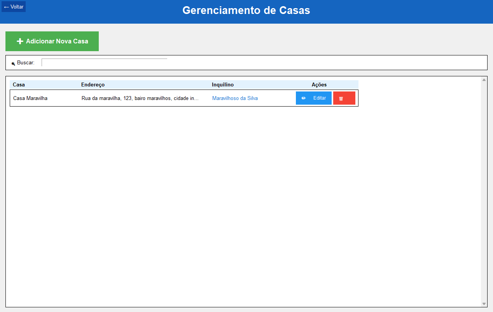
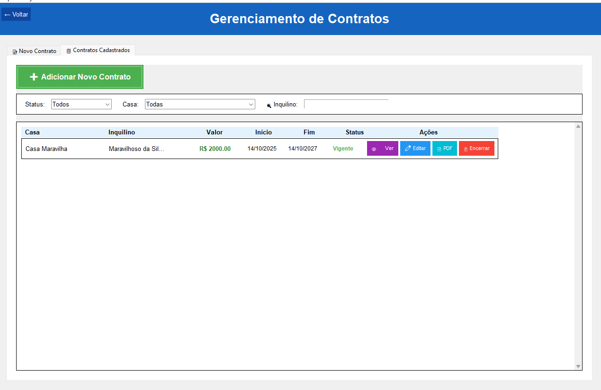
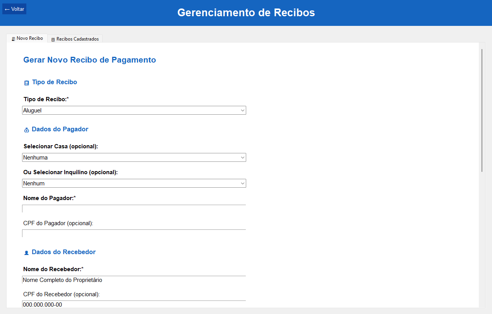

# 🏠 AluguelFácil

<div align="center">


**Sistema completo de gestão de aluguéis residenciais**

Gerencie propriedades, inquilinos, contratos e pagamentos de forma simples e profissional.

[📥 Download](#-instalação-rápida-recomendado) • [📖 Documentação](#-funcionalidades) • [🚀 Começar](#-instalação-para-desenvolvimento)

</div>

---

## 📋 Índice

- [Sobre o Projeto](#-sobre-o-projeto)
- [Funcionalidades](#-funcionalidades)
- [Capturas de Tela](#-capturas-de-tela)
- [Instalação Rápida](#-instalação-rápida-recomendado)
- [Instalação para Desenvolvimento](#-instalação-para-desenvolvimento)
- [Como Usar](#-como-usar)
- [Configuração](#-configuração)
- [Tecnologias](#-tecnologias-utilizadas)
- [Estrutura do Projeto](#-estrutura-do-projeto)
- [Contribuindo](#-contribuindo)
- [Licença](#-licença)
- [Suporte](#-suporte)

---

## 🎯 Sobre o Projeto

O **AluguelFácil** é um sistema desktop desenvolvido em Python para facilitar a gestão de imóveis alugados. Com interface intuitiva e funcionalidades completas, o sistema permite controlar desde o cadastro de propriedades até a geração de documentos em PDF.

### 💡 Por que usar?

- ✅ **Simples**: Interface amigável, sem complexidade
- ✅ **Completo**: Todas as funcionalidades essenciais em um só lugar
- ✅ **Profissional**: Gera contratos e recibos em PDF
- ✅ **Offline**: Funciona sem internet, seus dados ficam no seu computador
- ✅ **Gratuito**: Código aberto e sem custos de licença

### 🎓 Ideal para:

- Proprietários com múltiplos imóveis
- Administradoras de imóveis pequenas e médias
- Imobiliárias que gerenciam aluguéis
- Pessoas físicas que alugam propriedades

---

## ✨ Funcionalidades

### 🏠 **Gestão de Imóveis**
- Cadastro completo de casas/apartamentos
- Registro de endereço, número de quartos
- Vinculação com inquilinos atuais
- Histórico de ocupação

### 👥 **Gestão de Inquilinos**
- Cadastro com dados pessoais (CPF, telefone, data de nascimento)
- Registro de fiador
- Busca rápida por nome ou CPF
- Histórico de contratos

### 📝 **Contratos de Locação**
- Geração de contratos completos
- Configuração de valores, multas e garantias
- Cálculo automático de datas e períodos
- Controle de status (Vigente, Vencido, Encerrado)
- Geração de PDF do contrato
- Filtros por casa, inquilino e status

### 🧾 **Recibos de Pagamento**
- Geração de recibos personalizados
- Múltiplos tipos: Aluguel, Energia, Serviços
- Valor por extenso automático
- Histórico completo de pagamentos
- Exportação em PDF profissional

### ⚡ **Contas de Energia**
- Cálculo proporcional de consumo
- Rateio automático entre inquilinos
- Histórico de consumo mensal
- Geração de conta individual em PDF
- Gráficos de consumo histórico

### 📊 **Relatórios**
- Geração de documentos em PDF
- Contratos de locação formatados
- Recibos profissionais
- Contas de energia detalhadas

---

## 📸 Capturas de Tela

### Tela Inicial


### Gestão de Casas


### Contratos


### Geração de Recibos


---

## 📥 Instalação Rápida (RECOMENDADO)

### Para Usuários Finais

> 💡 **Método mais simples!** Não precisa instalar Python nem dependências.

#### 1️⃣ Baixar o Instalador

Baixe a versão mais recente:

```
👉 AluguelFacil_Instalador.exe (v1.0.0)
📦 Tamanho: ~120 MB
```

[⬇️ **Download Direto**](https://github.com/seu-usuario/aluguel-facil/releases/latest)

#### 2️⃣ Executar a Instalação

1. Execute o arquivo baixado: `AluguelFacil_Instalador.exe`
2. Siga o assistente de instalação:
   - **Avançar** → Aceitar termos
   - **Avançar** → Escolher pasta (padrão: `C:\Program Files\AluguelFacil`)
   - **Avançar** → Criar atalho na área de trabalho
   - **Instalar** → Aguardar
   - **Concluir** → Executar o programa

#### 3️⃣ Configurar seus Dados

Na primeira execução:

1. Abra a pasta de instalação (clique com botão direito no atalho → **Abrir local do arquivo**)
2. Edite o arquivo `.env` com **Bloco de Notas**
3. Preencha seus dados:

```env
# Seus dados pessoais
LOCADOR_NOME=João Silva
LOCADOR_CPF=123.456.789-00
LOCADOR_RG=12.345.678-9
LOCADOR_ENDERECO=Rua Exemplo, 123, Centro, Salvador-BA

# Dados para recebimento
TITULAR_CONTA=João Silva
PIX=(71) 99999-9999
BANCO=Banco do Brasil
```

4. Salve e feche
5. **Reinicie o programa**

#### ✅ Pronto!

O sistema está instalado e configurado. Use o atalho na área de trabalho para abrir.

---

## 🛠️ Instalação para Desenvolvimento

### Para Desenvolvedores

#### Pré-requisitos

- Python 3.10 ou superior
- pip (gerenciador de pacotes Python)
- Git (opcional)

#### 1️⃣ Clonar o Repositório

```bash
git clone https://github.com/seu-usuario/aluguel-facil.git
cd aluguel-facil
```

Ou [baixe o ZIP](https://github.com/seu-usuario/aluguel-facil/archive/refs/heads/main.zip) e extraia.

#### 2️⃣ Criar Ambiente Virtual (Recomendado)

**Windows:**
```bash
python -m venv venv
venv\Scripts\activate
```

**Linux/Mac:**
```bash
python3 -m venv venv
source venv/bin/activate
```

#### 3️⃣ Instalar Dependências

```bash
pip install -r requirements.txt
```

**Dependências principais:**
- `tkinter` - Interface gráfica (já vem com Python)
- `reportlab` - Geração de PDFs
- `sqlalchemy` - Banco de dados
- `python-dotenv` - Configurações
- `tkcalendar` - Seletor de datas
- `python-dateutil` - Manipulação de datas
- `Pillow` - Processamento de imagens

#### 4️⃣ Configurar Variáveis de Ambiente

Crie um arquivo `.env` na raiz do projeto:

```bash
cp .env.example .env
```

Edite com seus dados:

```env
# Configurações do Locador
LOCADOR_NOME=Seu Nome Completo
LOCADOR_CPF=000.000.000-00
LOCADOR_RG=00.000.000-0
LOCADOR_ENDERECO=Seu endereço completo

# Dados Bancários
TITULAR_CONTA=Nome para PIX
PIX=sua-chave-pix
BANCO=Seu Banco
```

#### 5️⃣ Executar o Sistema

```bash
python main.py
```

#### 🎉 Sistema Rodando!

O banco de dados será criado automaticamente no primeiro uso: `casas_consumo.db`

---

## 🚀 Como Usar

### Primeiro Acesso

1. **Cadastrar Casas**
   - Acesse: `🏘️ Casas`
   - Clique em `➕ Adicionar Nova Casa`
   - Preencha: Nome, Endereço, Quartos

2. **Cadastrar Inquilinos**
   - Acesse: `👥 Inquilinos`
   - Clique em `➕ Adicionar Novo Inquilino`
   - Preencha: Nome, CPF, Data de Nascimento, Telefone

3. **Criar Contratos**
   - Acesse: `📄 Contratos`
   - Clique em `📝 Novo Contrato`
   - Selecione: Casa, Inquilino
   - Configure: Valores, Datas, Multas
   - Clique em `💾 Salvar` ou `📄 Gerar PDF`

### Fluxo Mensal

1. **Gerar Conta de Energia**
   - Acesse: `⚡ Conta de Energia`
   - Selecione a casa
   - Informe: Leituras, Consumo Geral, Valor Total
   - Sistema calcula automaticamente a parte do inquilino
   - Gere o PDF da conta

2. **Emitir Recibos**
   - Acesse: `🧾 Recibos`
   - Clique em `➕ Adicionar Novo Recibo`
   - Preencha: Pagador, Valor, Referência
   - Gere o PDF do recibo

### Funcionalidades Avançadas

- **Busca Rápida**: Use a barra de pesquisa em cada módulo
- **Filtros**: Filtre contratos por status, casas por inquilino
- **Histórico**: Veja todo histórico de contas e pagamentos
- **Reimprimir**: Reemita PDFs de documentos antigos

---

## ⚙️ Configuração

### Arquivo `.env`

Todas as configurações ficam no arquivo `.env`:

```env
# ===== DADOS DO PROPRIETÁRIO =====
LOCADOR_NOME=João Silva
LOCADOR_CPF=123.456.789-00
LOCADOR_RG=12.345.678-9
LOCADOR_ENDERECO=Rua das Flores, 100, Barra, Salvador-BA, CEP 40140-000

# ===== DADOS BANCÁRIOS =====
TITULAR_CONTA=João Silva
PIX=(71) 98765-4321
BANCO=Banco do Brasil
AGENCIA=1234-5
CONTA=12345-6

# ===== CONFIGURAÇÕES DO SISTEMA =====
# Deixe em branco para usar padrões
# DATABASE_URL=sqlite:///meu_banco.db
```

### Banco de Dados

O sistema usa **SQLite**, um banco de dados local que não requer instalação.

- **Arquivo**: `casas_consumo.db` (criado automaticamente)
- **Localização**: Raiz do projeto / pasta de instalação
- **Backup**: Copie o arquivo `.db` regularmente

### PDFs Gerados

PDFs são salvos na mesma pasta do executável:

- Contratos: `Contrato_[Casa]_[Data].pdf`
- Recibos: `Recibo_[Numero]_[Pagador]_[Data].pdf`
- Contas: `Conta_[Casa]_[Mes]_[Ano].pdf`

---

## 🔧 Tecnologias Utilizadas

### Core
- **Python 3.10+** - Linguagem principal
- **Tkinter** - Interface gráfica nativa

### Backend
- **SQLAlchemy 2.0** - ORM para banco de dados
- **SQLite** - Banco de dados embutido

### Geração de PDFs
- **ReportLab 4.0** - Criação de documentos PDF
- **Pillow** - Manipulação de imagens

### Utilidades
- **python-dotenv** - Gerenciamento de configurações
- **tkcalendar** - Seletor de datas visual
- **python-dateutil** - Cálculos com datas

### Build
- **PyInstaller** - Geração de executável
- **Inno Setup** - Criação do instalador

---

## 📂 Estrutura do Projeto

```
AluguelFacil/
│
├── app/                                # Código da aplicação
│   ├── data/                          # Camada de dados
│   │   ├── database/                  # Configuração do banco
│   │   │   └── base.py               # Setup SQLAlchemy
│   │   ├── models/                    # Modelos de dados
│   │   │   ├── house.py              # Modelo Casa
│   │   │   ├── Tenant.py             # Modelo Inquilino
│   │   │   ├── contract.py           # Modelo Contrato
│   │   │   ├── receipt.py            # Modelo Recibo
│   │   │   └── consumption.py        # Modelo Consumo
│   │   └── repositories/              # Repositórios (acesso a dados)
│   │       ├── base_repository.py
│   │       ├── house_repository.py
│   │       ├── tenant_repository.py
│   │       ├── contract_repository.py
│   │       ├── receipt_repository.py
│   │       └── consumption_repository.py
│   │
│   ├── domain/                        # Lógica de negócio
│   │   └── eletricity_bill/
│   │       └── eletricity_bill_entity.py  # Cálculos de energia
│   │
│   └── presentation/                  # Interface e apresentação
│       ├── views/                     # Telas principais
│       │   ├── home_view.py          # Tela inicial
│       │   ├── house_register_view.py
│       │   ├── tenant_register_view.py
│       │   ├── contract_view.py
│       │   ├── receipt_view.py
│       │   └── electricity_bill_view.py
│       │
│       ├── widgets/                   # Componentes reutilizáveis
│       │   ├── header_widget.py
│       │   ├── house_list_widget.py
│       │   ├── tenant_list_widget.py
│       │   ├── contract_list_widget.py
│       │   ├── receipt_list_widget.py
│       │   └── ...
│       │
│       └── usecases/                  # Casos de uso
│           ├── generate_pdf_usecase.py
│           ├── generate_contract_pdf_usecase.py
│           └── generate_receipt_pdf_usecase.py
│
├── main.py                            # Ponto de entrada
├── requirements.txt                   # Dependências Python
├── .env                              # Configurações (não versionar!)
├── .env.example                      # Exemplo de configurações
├── build_exe.py                      # Script para gerar .exe
├── requirements_build.txt            # Dependências de build
└── README.md                         # Este arquivo

```

---

## 🤝 Contribuindo

Contribuições são bem-vindas! 

### Como Contribuir

1. **Fork** o projeto
2. Crie uma **branch** para sua feature (`git checkout -b feature/MinhaFeature`)
3. **Commit** suas mudanças (`git commit -m 'Adiciona MinhaFeature'`)
4. **Push** para a branch (`git push origin feature/MinhaFeature`)
5. Abra um **Pull Request**

### Diretrizes

- Siga o padrão de código existente
- Adicione testes se possível
- Atualize a documentação
- Descreva claramente as mudanças no PR

### Reportar Bugs

Encontrou um bug? [Abra uma issue](https://github.com/seu-usuario/aluguel-facil/issues/new) com:

- Descrição clara do problema
- Passos para reproduzir
- Comportamento esperado vs atual
- Screenshots (se aplicável)
- Versão do sistema e Python

---

## 📄 Licença

Este projeto está sob a licença **MIT**. Veja o arquivo [LICENSE](LICENSE) para mais detalhes.

```
MIT License

Copyright (c) 2025 [Seu Nome]

Permission is hereby granted, free of charge, to any person obtaining a copy
of this software and associated documentation files (the "Software"), to deal
in the Software without restriction, including without limitation the rights
to use, copy, modify, merge, publish, distribute, sublicense, and/or sell
copies of the Software, and to permit persons to whom the Software is
furnished to do so, subject to the following conditions:

The above copyright notice and this permission notice shall be included in all
copies or substantial portions of the Software.

THE SOFTWARE IS PROVIDED "AS IS", WITHOUT WARRANTY OF ANY KIND, EXPRESS OR
IMPLIED, INCLUDING BUT NOT LIMITED TO THE WARRANTIES OF MERCHANTABILITY,
FITNESS FOR A PARTICULAR PURPOSE AND NONINFRINGEMENT. IN NO EVENT SHALL THE
AUTHORS OR COPYRIGHT HOLDERS BE LIABLE FOR ANY CLAIM, DAMAGES OR OTHER
LIABILITY, WHETHER IN AN ACTION OF CONTRACT, TORT OR OTHERWISE, ARISING FROM,
OUT OF OR IN CONNECTION WITH THE SOFTWARE OR THE USE OR OTHER DEALINGS IN THE
SOFTWARE.
```

---

## 📞 Suporte

### Precisa de ajuda?

- 📧 **Email**: seu-email@exemplo.com
- 💬 **WhatsApp**: (71) 99999-9999
- 🐛 **Issues**: [GitHub Issues](https://github.com/seu-usuario/aluguel-facil/issues)
- 📚 **Documentação**: [Wiki do Projeto](https://github.com/seu-usuario/aluguel-facil/wiki)

### FAQ - Perguntas Frequentes

**P: O sistema funciona sem internet?**  
R: Sim! Todos os dados ficam no seu computador.

**P: Meus dados estão seguros?**  
R: Sim! O banco de dados fica apenas no seu computador, você tem controle total.

**P: Posso usar em múltiplos computadores?**  
R: Sim! Basta copiar o arquivo `casas_consumo.db` entre os computadores.

**P: Como faço backup dos meus dados?**  
R: Copie regularmente o arquivo `casas_consumo.db` para um local seguro (nuvem, HD externo).

**P: Funciona no Linux/Mac?**  
R: O código Python funciona, mas o instalador .exe é só Windows. No Linux/Mac, use a [instalação para desenvolvimento](#-instalação-para-desenvolvimento).

**P: Posso personalizar os PDFs?**  
R: Sim! Edite os arquivos em `app/presentation/usecases/` com os templates dos PDFs.

**P: Quantos imóveis posso cadastrar?**  
R: Ilimitado! O SQLite suporta bancos de dados grandes.

---

## 🙏 Agradecimentos

- Comunidade Python Brasil
- Documentação do SQLAlchemy
- Criadores do ReportLab
- Todos os contribuidores do projeto

---

## 📊 Status do Projeto

- ✅ **v1.0.0** - Versão estável lançada
- 🚧 **v1.1.0** - Em desenvolvimento
  - [ ] Módulo de Relatórios
  - [ ] Dashboard com gráficos
  - [ ] Exportação para Excel
  - [ ] Notificações de vencimento

---

## 🌟 Apoie o Projeto

Se este projeto te ajudou, considere:

- ⭐ Dar uma estrela no GitHub
- 🐛 Reportar bugs
- 💡 Sugerir melhorias
- 🤝 Contribuir com código
- 📢 Compartilhar com outros

---

<div align="center">

**Desenvolvido com ❤️ usando Python**

[⬆ Voltar ao topo](#-aluguel-fácil)

</div>